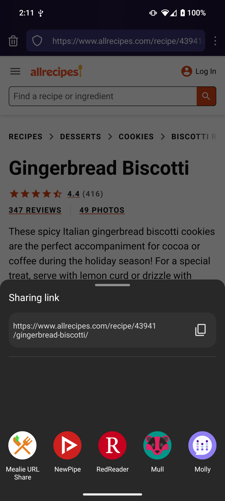
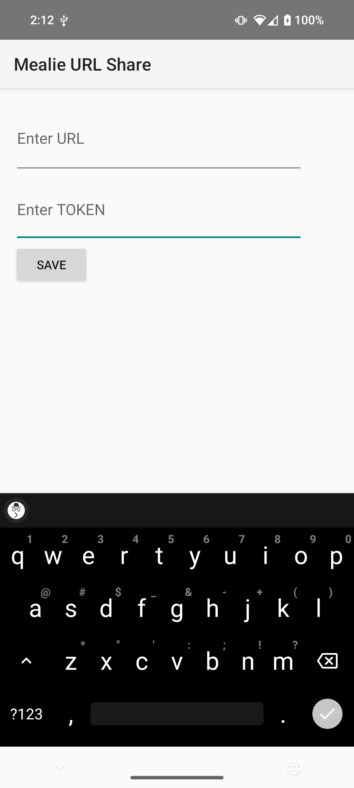

# Mealie Android Share

## Simple Android App to easily share recipe URLs to a locally owned Mealie server.

The app is *very* basic.

The main activity stores your server URL and API token in a SQLite DB.

Then you can click your Android's "Share" button and select "Mealie URL Share" and it will send the URL to your server for parsing.

Will work with any shared URL.

NOTE: This doesn't verify URLs or check for duplicates.

Screenshots:

